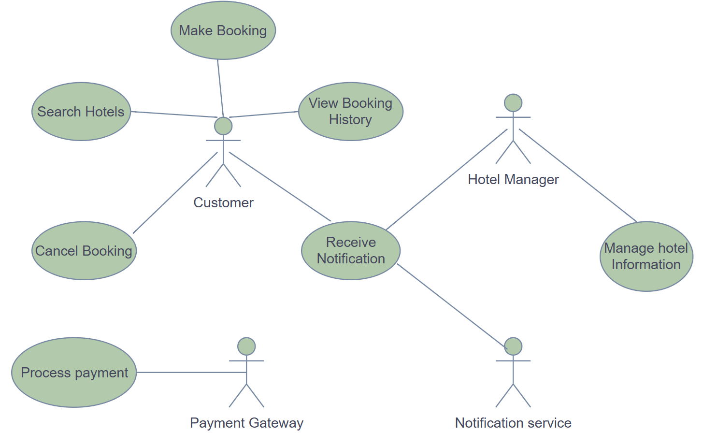

# requirement-analysis
## 📌 Purpose of the Repository

This repository serves as a structured workspace to perform and document the **requirement analysis phase** of a software project — specifically for a **Booking Management System**.

It is designed to simulate a real-world software development scenario by guiding developers through the process of:

- Gathering and analyzing project requirements
- Distinguishing between functional and non-functional requirements
- Documenting use cases and acceptance criteria
- Creating system diagrams and visual representations
- Producing clear, professional, and industry-standard documentation

The ultimate goal is to lay a strong foundation for the software development lifecycle (SDLC) by ensuring that the project’s scope, expectations, and user needs are clearly defined and agreed upon before implementation begins.

This project reinforces core skills in **requirement engineering**, which is critical to building scalable, maintainable, and successful software systems.
## 🧠 What is Requirement Analysis?

**Requirement Analysis** is a critical phase in the Software Development Life Cycle (SDLC) where the needs, expectations, and constraints of stakeholders are identified, documented, analyzed, and validated before any actual development begins.

This process ensures that everyone involved in the project — from clients to developers — has a clear and shared understanding of **what the software system must do** and **how it should perform**. It sets the foundation for the entire project by answering key questions like:

- What problem is the software solving?
- Who are the users?
- What features and functionality are needed?
- What constraints and limitations exist?

### ✨ Importance of Requirement Analysis in SDLC:

- ✅ **Clarity & Alignment**: Ensures all stakeholders have a shared understanding of the system’s purpose and scope.
- ✅ **Reduces Rework**: Catching gaps or misunderstandings early avoids costly changes later in the development cycle.
- ✅ **Improves Planning**: Helps in accurate estimation of time, resources, and budget.
- ✅ **Guides Design & Development**: Acts as a blueprint for system architecture and feature implementation.
- ✅ **Enhances Quality**: Well-defined requirements lead to better testing, validation, and user satisfaction.
## ❓ Why is Requirement Analysis Important?

Requirement Analysis plays a foundational role in the success of any software project. It ensures the software meets user expectations, aligns with business goals, and is feasible to implement. Here are three key reasons why this phase is critical in the Software Development Life Cycle (SDLC):

### 1. ✅ Prevents Miscommunication and Scope Creep
Clear and detailed requirements minimize the risk of misunderstandings between stakeholders and developers. Without this clarity, developers might build a system that doesn’t align with business needs, leading to costly revisions and scope creep.

### 2. ✅ Improves Project Planning and Estimation
By understanding what needs to be built, teams can accurately estimate time, resources, cost, and effort. This helps in setting realistic deadlines and budget allocations, leading to more efficient project management.

### 3. ✅ Enhances Product Quality and User Satisfaction
Well-defined requirements guide the development and testing phases, ensuring the final product behaves as expected. This leads to fewer bugs, better performance, and higher satisfaction among users and clients.
## 🔍 Key Activities in Requirement Analysis

The Requirement Analysis process consists of several key activities that ensure the success of a software project by thoroughly understanding and defining what needs to be built.

- **📥 Requirement Gathering**  
  Engage with stakeholders to collect initial requirements.  
  Use various techniques like interviews, surveys, and workshops.

- **🗣️ Requirement Elicitation**  
  Refine and elaborate on the gathered requirements.  
  Use techniques like brainstorming, focus groups, and prototyping.

- **📝 Requirement Documentation**  
  Document the requirements in a detailed and structured format.  
  Use requirement specification documents, user stories, and use cases.

- **📊 Requirement Analysis and Modeling**  
  Analyze and prioritize the requirements.  
  Create models to visualize and understand the requirements.

- **✅ Requirement Validation**  
  Review and validate the requirements with stakeholders.  
  Define acceptance criteria and ensure traceability.
## 🧩 Types of Requirements

### Functional Requirements

Functional requirements define **what** the system should do — the core features and actions the software must support. For the booking management system, examples include:

- **Hotel Management:** Hotel managers can add, update, and manage hotel information through a dedicated portal.
- **Search:** Customers can search hotels by location, availability, and other criteria, supported by a fast search engine (ElasticSearch).
- **Booking:** Users can make, view, and cancel bookings with real-time availability checks.
- **Payment Processing:** The system integrates with third-party payment services to process payments securely.
- **Notifications:** The system sends notifications to customers and managers (e.g., booking confirmations, new offers) using a messaging queue and notification consumers.

### Non-functional Requirements

Non-functional requirements specify **how** the system performs and quality attributes important to stakeholders. Examples from the case study include:

- **Scalability:** The system uses microservices architecture with load balancers and multiple servers to handle high user traffic efficiently.
- **Performance:** Use of caching (Redis) and fast search engines (ElasticSearch) to reduce response times and improve user experience.
- **Reliability:** Data replication with master-slave databases and backup storage (Cassandra) ensures data consistency and availability.
- **Security:** Secure handling of payment information and user data, with system components isolated by service boundaries.
- **Maintainability:** Modular microservice design enables easier updates and scaling of individual components without affecting the entire system.
- **Data Consistency:** Use of messaging queues (Kafka, RabbitMQ) ensures eventual consistency and reliable communication between services.
## 🎯 Use Case Diagrams

**Use Case Diagrams** are visual representations used in Requirement Analysis to illustrate the interactions between users (actors) and the system. They help to clarify the system’s functional requirements by showing which actors perform which use cases (actions or services provided by the system).

### Benefits of Use Case Diagrams:
- Provide a clear overview of system functionality from the user's perspective.
- Help identify all user roles (actors) and their interactions.
- Facilitate communication between stakeholders and developers.
- Assist in identifying missing requirements or potential system boundaries.

### Actors and Use Cases for the Booking Management System:

**Actors:**
- Hotel Manager
- Customer
- Payment Gateway
- Notification Service

**Use Cases:**
- Manage Hotel Information
- Search Hotels
- Make Booking
- Cancel Booking
- Process Payment
- Receive Notifications
- View Booking History

## 📌 Acceptance Criteria

### What is Acceptance Criteria?

**Acceptance Criteria** are a set of predefined requirements that must be met for a feature to be considered complete and accepted by stakeholders. They are written in clear, simple language and help ensure that the development team and stakeholders share a common understanding of the feature’s functionality.

---

### 🔍 Importance of Acceptance Criteria in Requirement Analysis

- ✅ **Clarifies expectations**: Ensures developers, testers, and stakeholders are aligned on what needs to be built.
- 🧪 **Guides testing**: Defines how a feature should be tested and when it passes.
- 🛠️ **Prevents scope creep**: Clearly outlines boundaries, so only the required functionality is delivered.
- 📋 **Improves communication**: Serves as a checklist during development and review.
- 🧑‍💻 **Enables user-centric development**: Keeps the focus on delivering value to the end user.

---

### ✅ Example: Acceptance Criteria for the **Checkout** Feature

> **Feature**: Checkout – allows users to finalize and confirm their hotel booking.

**Acceptance Criteria:**
- User must be logged in to proceed to checkout.
- User must select at least one hotel room to proceed.
- System must display total price, taxes, and applicable discounts.
- User must be able to choose a payment method (e.g., card, wallet).
- Payment must be processed securely via third-party payment gateway.
- Upon successful payment, the system must display a confirmation message and send a booking confirmation email.
- If payment fails, the system must inform the user and allow retry.
